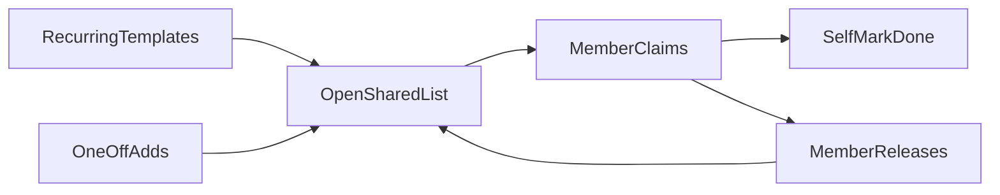

# Household chores tool — v1 scope

## Product

A **phone-friendly shared web app** for **one household** (you + roommates/partners) to manage chores via a **claim-from-list** workflow.

## How it works

1. Household members join with an **invite link/code** (no email required).
2. **Admins** manage recurring templates; **anyone** can add one-off chores.
3. Recurring templates and one-offs feed an **open shared list**.
4. A member **claims** a chore; it stays theirs until they **complete** or **release** it.
5. Completion is **trust-based** (self-mark done).

## In scope (v1)

- One household
- Invite link/code join
- Roles: admin (templates) vs member (one-offs + claim/complete/release)
- Open list: unclaimed / mine / others’ claimed
- One-off chores + recurring templates that spawn open tasks
- Claim, release, self-complete
- Phone-friendly web UI

## Out of scope (v1)

- Multi-household / multi-tenant product
- Auto-rotation or fixed roster assignment
- Reminders, push, email, chat alerts
- Fairness scores / points / leaderboards
- Photo proof or peer confirmation
- Native mobile apps
- Auto-unclaim / steal

## Next

Stop at documentation unless you ask to start building.
