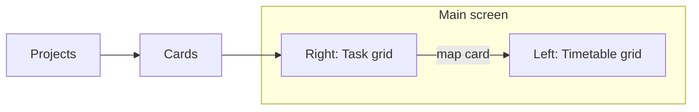

# Mini Kanban board — Plan

## Overview

Build an **end-to-end** personal planner app: **frontend**, **backend**, and **database**.

Personal use only (no login). Users manage **projects** and **cards**. The main screen is a **vertical split**:

| Left | Right |
|------|--------|
| **Timetable grid** | **Task grid** |

Cards live in the task grid (all projects in one view). Users **map** cards onto the timetable via drag and drop.

## Goals

- Full stack: UI + API + persistence
- Plan work across a week while managing tasks from multiple projects in one place

## Main UI layout

### Left — Timetable grid (fixed)

- **Columns:** Monday ? Sunday (always 7 days)
- **Rows:** hourly slots from **06:00** to **23:00** (same for every day)
- **Week labels:** generic template (no prev/next week navigation)
- User can enter a **start date on Monday**; Tue–Sun dates fill in automatically (display only, for understanding)
- Cards mapped from the task grid appear in day/time cells

### Right — Task grid

- Create cards for **different projects**
- **Single view** of cards across **all projects**
- Status changed via a **dropdown on each card** (Todo / In Progress / Completed)
- Map cards from here onto the timetable

## Product model

1. Create / list / rename / delete **projects**
2. Create / edit title / delete **cards** (each card belongs to a project)
3. Each card has a status: **Todo** / **In Progress** / **Completed** (dropdown)
4. View **all projects’ cards** together in the task grid
5. **Map** a card onto a timetable cell (day + hour)

## Mapping rules (v1)

- A mapped card occupies **exactly one cell** (one day + one hour)
- A card maps to **at most one** timetable slot
- A timetable cell holds **at most one** card
- **Move:** drag to another cell
- **Unmap:** drag back to the task grid
- Multi-hour ranges, clear button, and week navigation: **out of scope**
- Monday start date is optional labeling only (not a navigable calendar)

## In scope (v1)

- Bearer-token authentication (hashed passwords; login issues opaque tokens)
- Split layout: timetable (left) + task grid (right)
- Fixed week columns Mon–Sun; fixed hours 06:00–23:00
- Generic week template; optional Monday start date (auto-fills Tue–Sun labels)
- Projects CRUD
- Cards with **title only** + status dropdown
- All-projects card view in the task grid
- Drag-and-drop map / move / unmap between task grid and timetable
- Persist projects, cards, timetable mappings, and Monday start date

## Out of scope (v1)

- Multi-user / sharing / OAuth providers
- Custom timetable days/hours
- Real calendar week navigation (prev/next week)
- Multi-hour timetable bookings
- Multiple cards per cell / one card on multiple cells
- Card descriptions, labels, due dates, assignees
- Comments, attachments, activity history

## Stack

| Layer    | Choice |
|----------|--------|
| Frontend | Node.js + React |
| Backend  | Python + FastAPI (managed with **uv**) |
| Database | SQLite via SQLAlchemy (`DATABASE_URL`; Postgres-ready) |

## Discovery answers

1. **Audience:** single personal app (simple login + bearer tokens)
2. **Card status:** Todo / In Progress / Completed via **dropdown on the card**
3. **Cards:** title only (create, edit title, delete)
4. **Primary interaction:** drag and drop map from task grid to timetable
5. **Stack:** React + FastAPI + SQLite; **uv** for Python, **Node.js** for frontend
6. **Structure:** projects contain cards; cards have status
7. **Layout:** left = timetable; right = task grid (all projects’ cards)
8. **Slot duration:** exactly 1 hour per mapping (one cell)
9. **Cardinality:** one card ? at most one timetable slot
10. **Move / unmap:** drag only
11. **Week model:** generic Mon–Sun; optional Monday start date labels Tue–Sun
12. **Cell occupancy:** at most one card per cell

## Notes

- Discovery for v1 scope is complete.
- Repo layout: `backend/`, `frontend/`, `docs/`, `AGENTS.md`, `openapi.yaml`.
- Next: scaffold backend/frontend against `openapi.yaml`.
